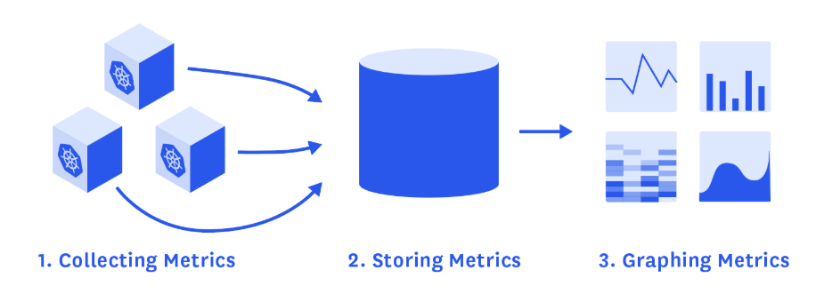
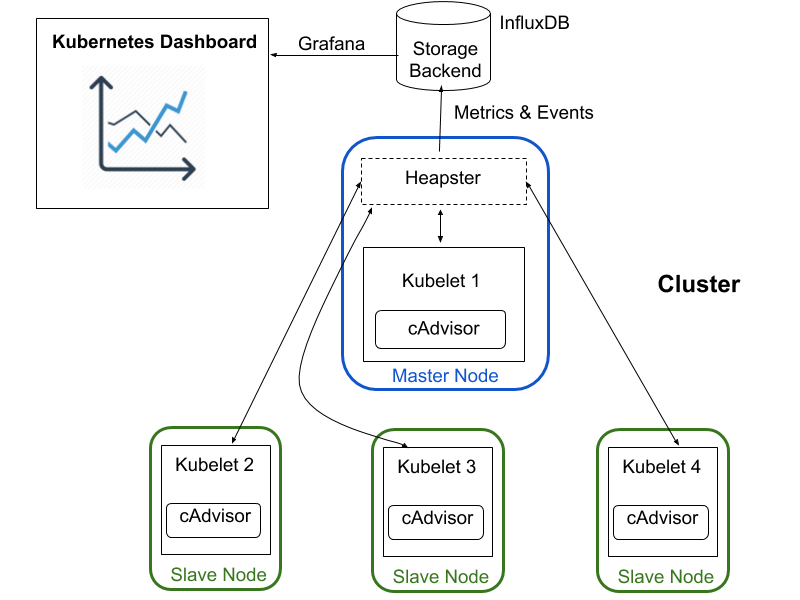
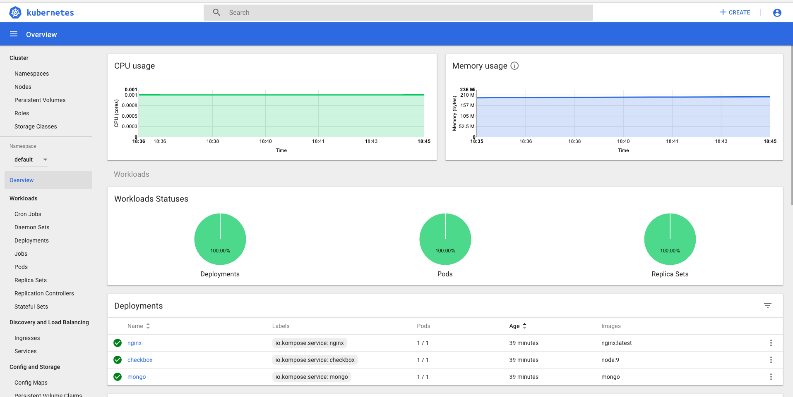
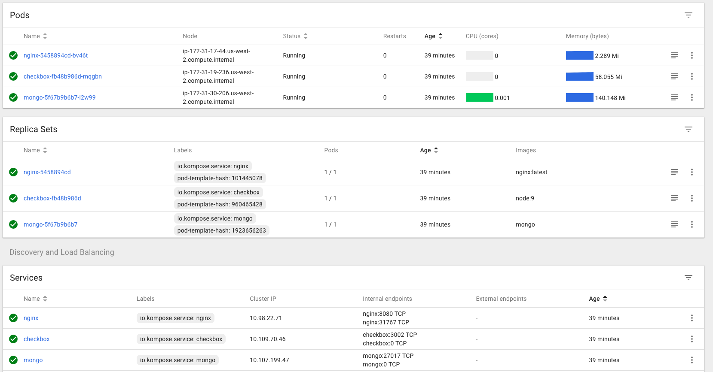
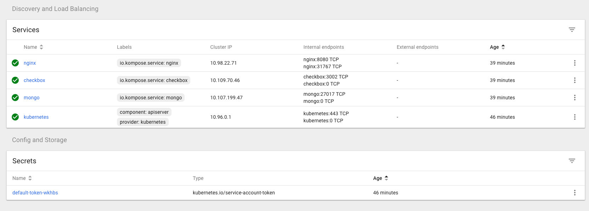
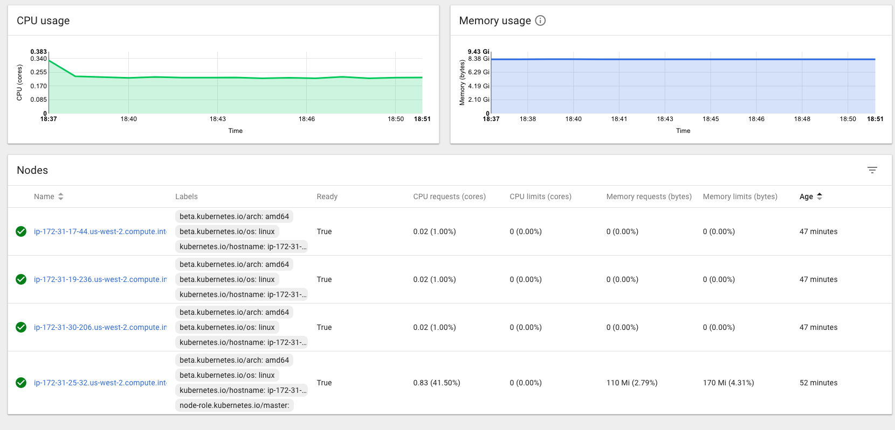
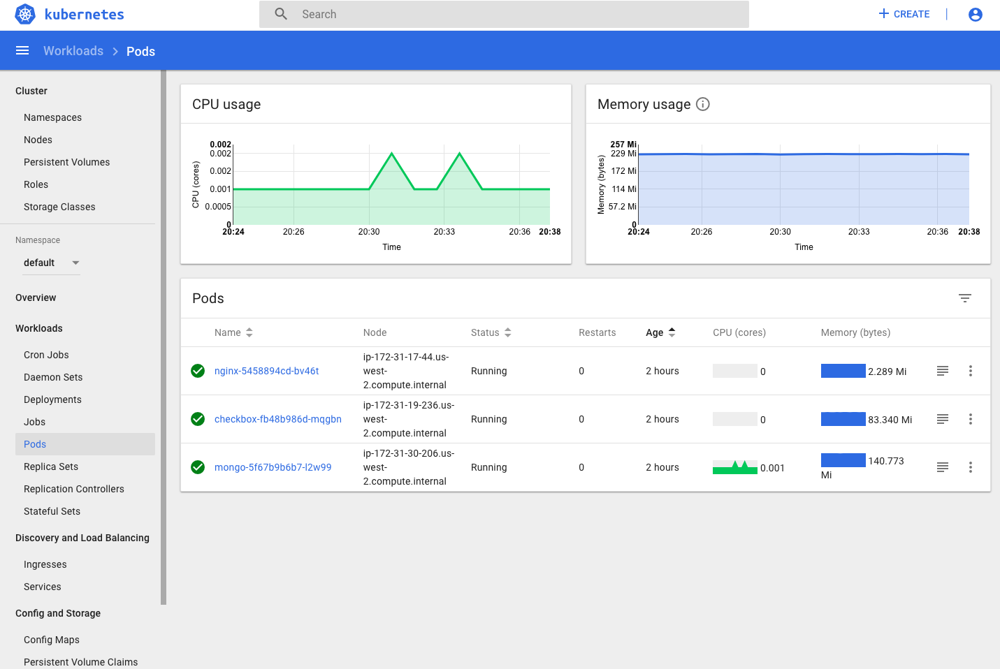

# DevOps-Project:  
# Milestone 4 SPECIAL - Kubernetes Cluster Monitoring
DevOps Project Spring 2018 NC State University

----------------------------------------   
## Team Members
|Name | Unity ID |
| :---: | :---: |
|1. Navjot Singh |       nsingh9|
|2. Khelan Patel     |        kjpatel4|
|3. Khantil Choksi|        khchoksi|
|4. Pavithra Iyer    |       piyer3|

----------------------------------------------------------------------------------

## Milestones

* [Milestone1](https://github.ncsu.edu/khchoksi/DevOps-Project/blob/milestone1/README.md)  
* [Milestone2](https://github.ncsu.edu/khchoksi/DevOps-Project/blob/milestone2/README.md)    
* [Milestone3](https://github.ncsu.edu/khchoksi/DevOps-Project/blob/milestone3/README.md)  


---------------------------------------------------------------------------

## Contribution 
   * *Kubernetes Dashboard:*  Khantil & Navjot
   * *Jenkins Slackbot Integration:* Khelan & Pavithra
   * *Screencast:* Navjot, Khantil, Khelan, Pavithra  
   
--------------------------------------------  
## Screencasts
* [Product Screencast]() 

-------------------------------------------------  
## Project Environment Setup:
* In our DevOps pipeline, one Kubernetes cluster containing one master and three slave nodes (EC2 instances) are configured for Dockerized version of checkbox.io. We have three pods (nginx, mongodb and checkbox) and respective three services already running.
------------------------------------------------- 
   
## Kubernetes Cluster Monitoring:

* By using proper tools, we can have good visibility into our containerized infrastructure and its orchestration. 
    

* **Heapster: Kubernetes’ own metrics collector:**   
    * Heapster is for now the go-to source for basic resource utilization metrics and events from our Kubernetes cluster.   
    * On each node, **cAdvisor** collects data about running containers that Heapster then queries through the kubelet of the node. The following solution to collect Kubernetes metrics, will give you more details on how Heapster works and how to configure it for with Grafana and Kubernetes dashboard.  
        
  --------------------------------------------------------------------------

### Implementation:
1. Kubernetes cluster is already setup or see instructions [here](https://github.ncsu.edu/khchoksi/DevOps-Project/tree/milestone3).  

2. **Heapster, InfluxDB and Grafana Running:**  
  Heapster has to be running in the cluster for the metrics and graphs to be available. For the integration of Heapster with backend DB InfluxDB and supporting graphs to be shown in Kubernetes Dashboard using Grafana, following yamls should be created to start and deploy services for influx, grafana and heapster.
  
     ```config
     kubectl create -f https://raw.githubusercontent.com/kubernetes/heapster/master/deploy/kube-config/influxdb/influxdb.yaml  
     
     kubectl create -f https://raw.githubusercontent.com/kubernetes/heapster/master/deploy/kube-config/influxdb/grafana.yaml  
     
     kubectl create -f https://raw.githubusercontent.com/kubernetes/heapster/master/deploy/kube-config/influxdb/heapster.yaml  
     ```  

3. **Creating Sample User to access Kubernetes Dashboard:**   
    * Creating Service Account with name `admin-user` in namespace `kube-system` first using [service_account.yaml](./monitoring/service-account/service_account.yaml):  
    ```kubectl create -f ./monitoring/service-account/service_account.yaml ```

4. **Create Cluster Role Binding:**  
    * After provisioning our cluster using `kubeadm`,  `admin` Role already exists in the cluster. We can use it and create only `RoleBinding` for our `ServiceAccount` using [cluster_role_binding.yaml](./monitoring/service-account/service_account.yaml):  
  ```kubectl create -f ./monitoring/service-account/cluster_role_binding.yaml ```   
     
5. **Bearer Token:**  
    * To find token to log in into Kubernetes Dashboard; execute following command:  
  ```kubectl -n kube-system describe secret $(kubectl -n kube-system get secret | grep admin-user | awk '{print $1}')```  
  
6. **Deploy Dasboard:**  
    * To deploy Dashboard, execute following command:  
      ```kubectl apply -f https://raw.githubusercontent.com/kubernetes/dashboard/master/src/deploy/recommended/kubernetes-dashboard.yaml```  
    * To access Dashboard from local workstation; create a secure channel to Kubernetes cluster's master node. Run the following command:  
    ```kubectl proxy```
    
7. **Accessing Dashboard:**  
      * We can now access dashboard:      
    ```http://localhost:8001/api/v1/namespaces/kube-system/services/https:kubernetes-dashboard:/proxy/```  
      * Here as of now, the deployment of Dashboard to public is not possbile due to their api concerns; so here I am using the SOCKS proxy to access the locally hosted Kubernetes Dashboard webpage inside the Kubernetes cluster's master node. To do this,  
    `ssh -D 8080 -i "kube-ec2.pem" centos@ec2-18-237-77-230.us-west-2.compute.amazonaws.com`.
    
-------------------------------------------------------------------------  
## Kubernetes Dashboard: 



  

  * **Chaos Experiment:** After running [shell script](./monitoring/chaos_cpu.sh) by using command: `sh chaos_cpu.sh` to increase the CPU usage of one of our node, following CPU usage graph in real-time is obtained.


---------------------------------------------------------

---------------------------------  

## References  
   * https://github.com/kubernetes/dashboard  
   * https://github.com/kubernetes/heapster
   * https://github.com/kubernetes/dashboard/wiki/Accessing-Dashboard---1.7.X-and-above  
   * https://github.com/kubernetes/dashboard/issues/1867  
   * https://github.com/CSC-DevOps/Chaos  
   * https://github.com/DataDog/the-monitor/blob/master/kubernetes/how-to-collect-and-graph-kubernetes-metrics.md  
   * https://www.datadoghq.com/blog/monitoring-kubernetes-performance-metrics/  
   * https://groups.google.com/forum/#!topic/kubernetes-dev/q8wdi6hJDkg    
   * https://askubuntu.com/questions/112177/how-do-i-tunnel-and-browse-the-server-webpage-on-my-laptop  
   


